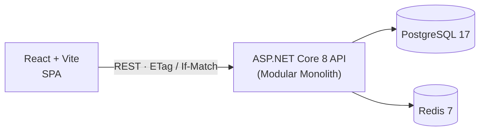
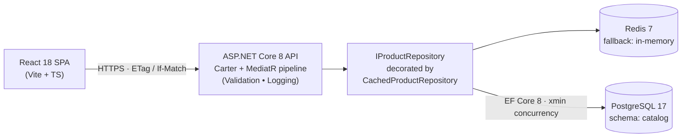
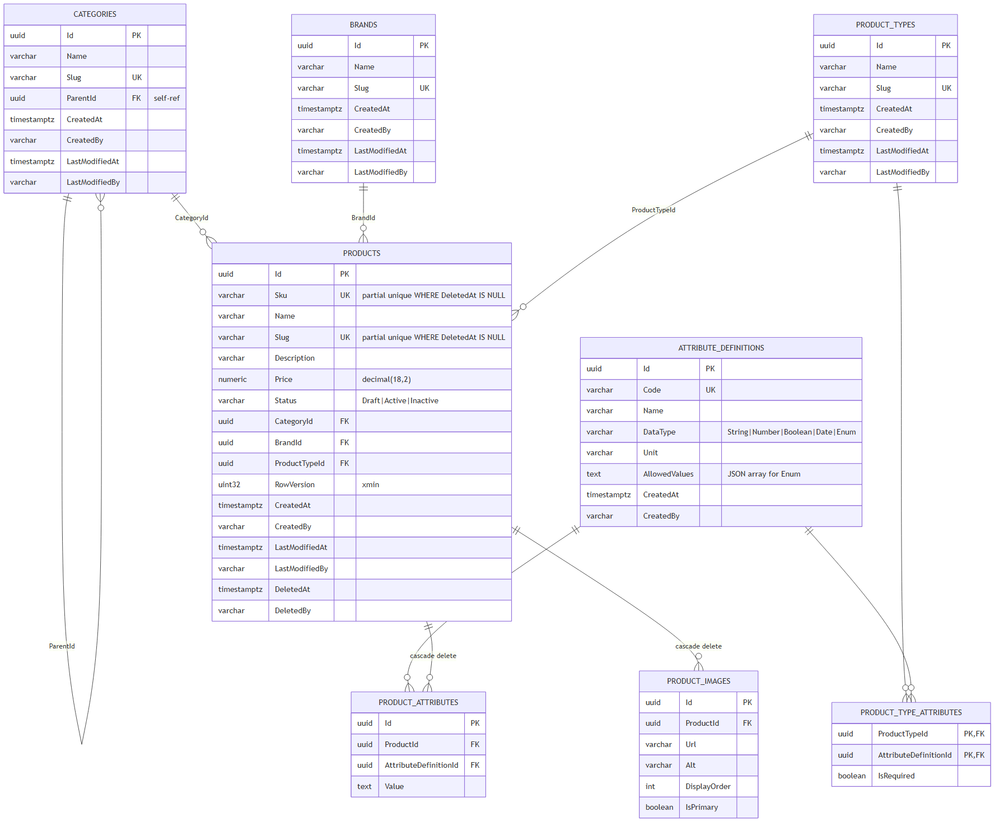
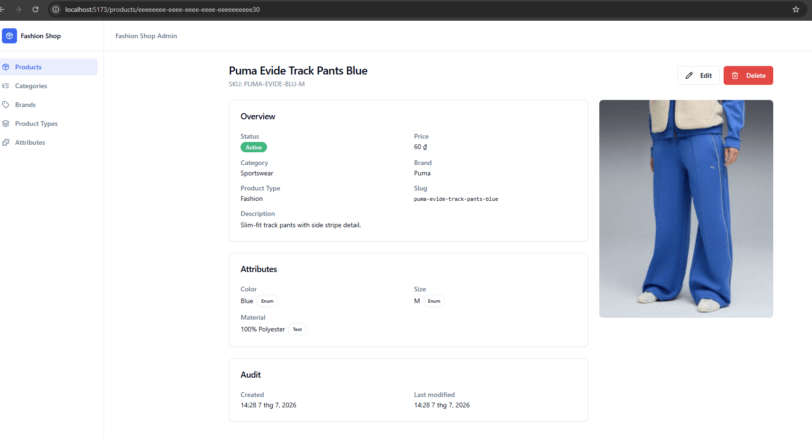
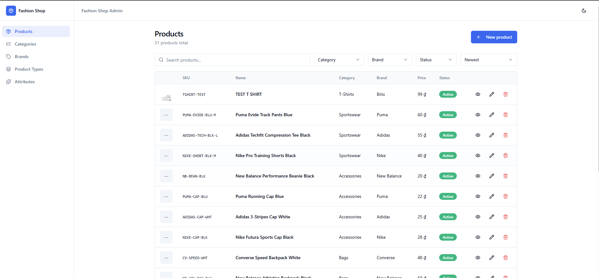
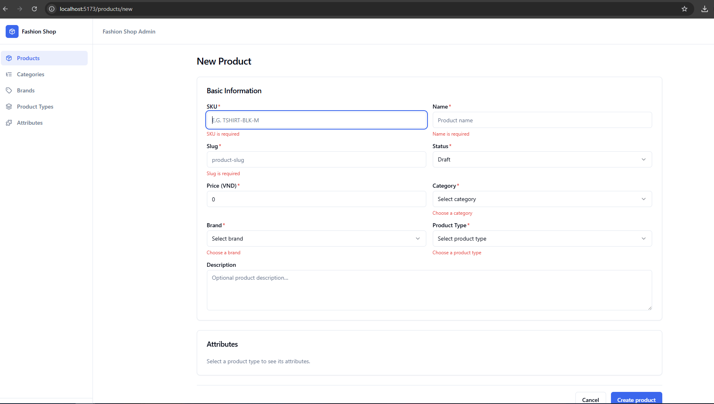
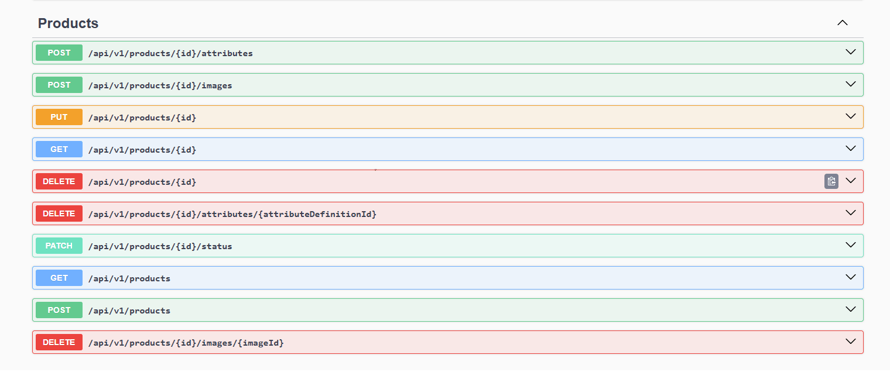

# Fashion Shop — ST Engineering .NET Developer Test

Full-stack product management for a fashion-shop catalog:

- **Task 4 — Backend** ([server-app/](server-app/)) — .NET 8 modular monolith, EAV attributes, optimistic concurrency, distributed cache.
- **Task 5 — Frontend** ([client-app/](client-app/)) — React 18 + Vite + TS SPA.
- **Differentiator** — EAV design lets new product attributes be added by insert (no migration), and every write is guarded by `ETag` / `If-Match`.



Runtime topology — internal design details in [§6](#6-design-details).

---

## 1. Technology Stack

| Layer | Choices |
| --- | --- |
| **Backend** | .NET 8, ASP.NET Core Minimal APIs + Carter, MediatR (CQRS + pipeline behaviors), EF Core 8 + Npgsql, FluentValidation, Mapster, Scrutor, Swashbuckle, `IExceptionHandler` + RFC 7807 |
| **Frontend** | Vite 5, React 18, TypeScript 5 (strict), React Router 6 (lazy), TanStack Query 5, Zustand, axios, react-hook-form + Zod, Tailwind + Radix UI, react-dropzone, sonner, @tanstack/react-table, pnpm + Node 20 |
| **Database** | PostgreSQL 17 — schema-per-module isolation (`catalog`), `xmin` optimistic concurrency, partial unique indexes, global soft-delete filter, migrations + idempotent seed run on startup |
| **Infrastructure** | Docker Compose (Postgres + Redis + API), Redis 7 (in-memory fallback), local disk for image uploads |

---

## 2. Quick Start

### Prerequisites

- **.NET 8 SDK** — https://dotnet.microsoft.com/download
- **Docker Desktop** (running) — https://www.docker.com/products/docker-desktop
- **Node 20 LTS** + **pnpm 9+** (`npm i -g pnpm`)
- **Git**

### Clone & run

```bash
git clone <repo-url> fashion-shop
cd fashion-shop
```

Docker Compose boots Postgres + Redis + API in one shot:

```bash
cd server-app
docker compose up --build
```

Second terminal — start the SPA:

```bash
cd client-app
cp .env.example .env.development   # Windows PowerShell: Copy-Item .env.example .env.development
pnpm install
pnpm dev
```

| Surface | URL / port | Credentials |
| --- | --- | --- |
| Swagger UI | http://localhost:5005/swagger | — |
| SPA | http://localhost:5173 | — |
| Postgres | `localhost:5434` (db `FashionShopDb`) | `postgres` / `postgres` |
| Redis | `localhost:6380` | — |

The API auto-migrates and seeds demo data on startup — Swagger is usable immediately.

### Verify

- **Swagger** — open http://localhost:5005/swagger, you should see `FashionShop Catalog API v1` with all Product / Category / Brand / Product Type / Attribute Definition endpoints listed.
- **SPA** — open http://localhost:5173, you should be redirected to `/products` and see the seeded catalogue (~30 products).
- **End-to-end demo** — import [docs/postman/](docs/postman/) into Postman, select the `FashionShop - Local` environment, and run the **`_Guided Demo Flow`** folder top-to-bottom. It walks through create → ETag round-trip → 409 conflict → soft delete.

### Troubleshooting

- **`port is already allocated` on 5434 / 6380 / 5005 / 5173** — a local Postgres / Redis / API / Vite is already using the port. Stop it, or remap host ports in [server-app/docker-compose.override.yml](server-app/docker-compose.override.yml) (and `VITE_API_BASE_URL` in [client-app/.env.example](client-app/.env.example) if you change the API port).
- **`Cannot connect to Docker daemon`** — Docker Desktop is not running. Start Docker Desktop and re-run `docker compose up --build`.

---

## 3. Deliverables

| Deliverable | Location |
| --- | --- |
| Runnable stack | `docker compose up --build` in [server-app/](server-app/) |
| Backend README | [server-app/README.md](server-app/README.md) |
| Frontend README | [client-app/README.md](client-app/README.md) |
| Technical report | [docs/report/report.md](docs/report/report.md) |
| ERD | [docs/erd/](docs/erd/) |
| Postman collection + environment | [docs/postman/](docs/postman/) — includes a **Guided Demo Flow** folder |
| Screenshots | [docs/screenshots/](docs/screenshots/) |

---

## 4. Implemented Features

**Backend**

- Product / Category / Brand / Product Type / Attribute Definition — full CRUD
- List with server-side filter, sort, pagination
- **EAV attributes** — add new product attributes without a migration
- **Optimistic concurrency** on Product writes (`ETag` / `If-Match`, stale token → 409)
- **Distributed cache** on hot reads (Redis, in-memory fallback)
- **Image upload** with primary-image invariant, MIME + size validation
- **RFC 7807 Problem Details** for every error (400 / 404 / 409 / 422 / 500)
- Automatic migrations + idempotent data seed on startup
- Swagger / OpenAPI at `/swagger`

**Frontend**

- List / Detail / Create / Edit / Delete product flows
- **Dynamic attribute editor** — form fields rendered from the selected Product Type; widget switches by `DataType`
- Image dropzone with per-file progress, preview grid, primary radio
- Automatic `ETag` capture and `If-Match` injection on writes
- **409 concurrency modal** (Stay here / Reload)
- Inline field errors mapped from RFC 7807 Problem Details
- Dark mode, debounced search, skeleton / empty / error states

---

## 5. Scope

**In scope**

- Product master data with EAV attributes, categories, brands, product types.
- CRUD + filter / sort / pagination for all entities above.
- Image upload, optimistic concurrency, distributed cache, RFC 7807 errors.
- SPA covering list / detail / create / edit / delete + dynamic attributes + upload.

**Out of scope** (documented as future work)

- Auth / user management (audit user hardcoded `"system"`).
- Automated tests (unit / integration / e2e).
- Basket & Ordering modules — skeleton `.csproj` only.
- Multi-currency, i18n, multi-tenant.

---

## 6. Design Details



- **Modular monolith** — `Bootstrapper/Api` hosts one or more modules; modules never cross-reference. Only `Catalog` is implemented; `Basket` and `Ordering` are reserved skeletons.
- **Vertical slice per feature** — one folder per use case containing endpoint + handler + validator.
- **EAV** — `ProductType` + `ProductTypeAttribute` + `AttributeDefinition` + `ProductAttribute` decouple shape from data.
- **Cache** — `Scrutor.Decorate` wraps `IProductRepository`; business handlers stay cache-agnostic.

Full discussion in [docs/report/report.md](docs/report/report.md).

---

## 7. ERD



Source: [docs/erd/catalog-erd.mmd](docs/erd/catalog-erd.mmd) · Design notes: [docs/erd/README.md](docs/erd/README.md).

---

## 8. Screenshots



*Product detail — the `Color` / `Size` / `Material` attributes are stored via EAV (`AttributeDefinition` + `ProductAttribute`), with `DataType` badges (`Enum` / `Text`) driving how each value is validated and rendered.*

| Product list (SPA) | Product create form (SPA) | Swagger UI |
| --- | --- | --- |
|  |  |  |

Full set (light + dark, image upload progress, 409 concurrency conflict) in [docs/screenshots/](docs/screenshots/).

---

## 9. Limitations & Report

- **Auth is stubbed** — audit user hardcoded `"system"`; JWT + `ICurrentUser` documented as the production wiring.
- **Missing `If-Match` bypasses concurrency** today — a strict deployment should return **428 Precondition Required**.
- **No automated tests** in the initial submission — `Product.Create` unit tests + handler integration tests against Postgres testcontainers are the natural next step.

Full trade-off discussion, self-assessment against the rubric, and future work in [docs/report/report.md](docs/report/report.md).