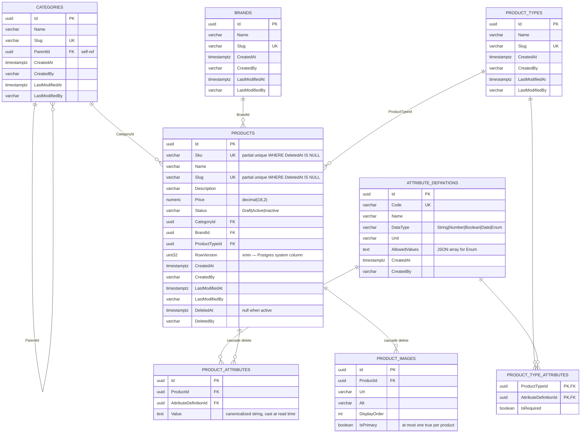

# ERD — Catalog Schema

Entity-relationship diagram for the `catalog` schema (Postgres 17).

The canonical source is [catalog-erd.mmd](catalog-erd.mmd) (Mermaid). Rendered outputs live alongside:

- `catalog-erd.png` — PNG export for the technical report.
- `catalog-erd.svg` — vector export (optional).

If you don't have a Mermaid renderer set up, the source is quoted in full below.

---

## Diagram (Mermaid)



---

## Notes on the design

### EAV — attribute definitions & template

- **`ATTRIBUTE_DEFINITIONS`** is the catalog of attributes a product can have (`Color`, `Size`, `Material`, `Fabric`, ...). `DataType` tells the write path how to validate the value.
- **`PRODUCT_TYPES`** is a template (`Fashion`, `Footwear`, ...) that declares — via **`PRODUCT_TYPE_ATTRIBUTES`** — which attributes are required (`IsRequired = true`) vs optional for products of that type.
- **`PRODUCT_ATTRIBUTES`** holds the actual value for a given `Product × AttributeDefinition`. Values are stored as strings and cast at read time based on `AttributeDefinition.DataType`.

Adding a new attribute (e.g. `Waterproof Rating`) is a single `INSERT` into `ATTRIBUTE_DEFINITIONS` and an optional link via `PRODUCT_TYPE_ATTRIBUTES`. **No migration required.**

### Concurrency — `xmin`

`PRODUCTS.RowVersion` is not a physical column. It maps to Postgres' hidden `xmin` system column via `builder.UseXminAsConcurrencyToken()` in EF Core. This gives us free optimistic concurrency without a maintained `byte[]` column.

### Soft delete

`PRODUCTS.DeletedAt` and `DeletedBy` are populated by `Product.SoftDelete(by)`. A global query filter (`HasQueryFilter(p => p.DeletedAt == null)`) hides deleted rows from every read path. Reads that need deleted rows use `.IgnoreQueryFilters()` explicitly.

### Indexes

Configured in [ProductConfiguration.cs](../../server-app/Modules/Catalog/Catalog/Data/Configurations/ProductConfiguration.cs):

| Index | Kind | Purpose |
| --- | --- | --- |
| `Products (Sku)` | Unique, partial `WHERE DeletedAt IS NULL` | SKU uniqueness across live rows only. |
| `Products (Slug)` | Unique, partial `WHERE DeletedAt IS NULL` | Slug uniqueness across live rows only. |
| `Products (Name)` | btree | Case-insensitive search prefix; `pg_trgm` GIN is a documented future upgrade. |
| `Products (Status, CategoryId)` | Composite | Most common list filter combination. |
| `Products (BrandId)` | FK | Join / filter. |
| `Products (ProductTypeId)` | FK | Join / filter. |
| `ProductAttributes (ProductId, AttributeDefinitionId)` | Unique | One value per attribute per product. |

### Primary-image invariant

`PRODUCT_IMAGES.IsPrimary` — at most one row per product may have `IsPrimary = true`. Enforced in the `Product.AddImage()` aggregate method: the previous primary is demoted before the new one is set. A partial unique index (`WHERE IsPrimary = true`) is a future defensive addition.

---

## How to regenerate the PNG

1. Install a Mermaid CLI (`npm i -g @mermaid-js/mermaid-cli`).
2. From this folder:
   ```bash
   mmdc -i catalog-erd.mmd -o catalog-erd.png -w 1600 -H 1200 --backgroundColor white
   ```
3. Commit the updated PNG.

Alternatively, paste [catalog-erd.mmd](catalog-erd.mmd) into https://mermaid.live and export as PNG.

---

## Source of truth

The EF Core configurations under [../../server-app/Modules/Catalog/Catalog/Data/Configurations/](../../server-app/Modules/Catalog/Catalog/Data/Configurations/) and the initial migration [20260707030621_InitialDb.cs](../../server-app/Modules/Catalog/Catalog/Data/Migrations/20260707030621_InitialDb.cs) are the authoritative schema definition. This ERD is derived from them and is regenerated when the schema changes.